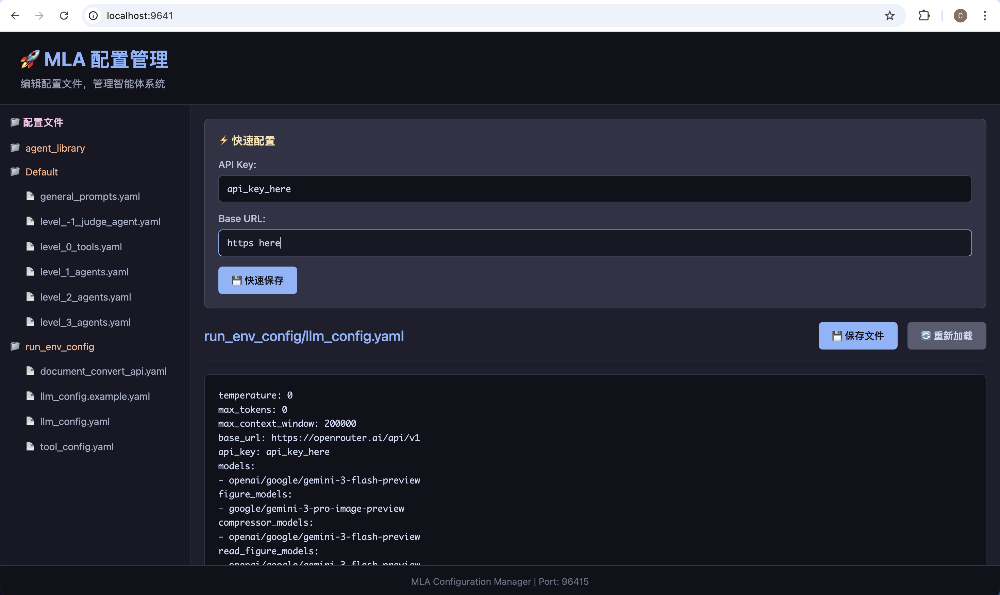

# MLA Docker 完整使用指南 🐳

**无需安装 Python，仅需 Docker！**

---

## 📋 目录

- [简介](#简介)
- [安装 Docker](#安装-docker)
- [快速开始](#快速开始)
- [配置管理](#配置管理)
- [数据持久化](#数据持久化)
- [常见问题](#常见问题)
- [高级使用](#高级使用)

---

## 📖 简介

MLA Docker 版本特点：

- ✅ **零依赖**：无需安装 Python 和依赖包
- ✅ **开箱即用**：一行命令启动
- ✅ **完整功能**：CLI、Tool Server、Config Web 全包含
- ✅ **跨平台**：Mac、Linux、Windows 统一体验
- ✅ **数据持久**：对话历史保存在宿主机

---

## 🔧 安装 Docker

### Mac

下载并安装 [Docker Desktop for Mac](https://www.docker.com/products/docker-desktop)

**M 系列芯片用户需安装 Rosetta 2：**
```bash
softwareupdate --install-rosetta --agree-to-license
```

### Windows

下载并安装 [Docker Desktop for Windows](https://www.docker.com/products/docker-desktop)

### Linux

```bash
# Ubuntu/Debian
curl -fsSL https://get.docker.com -o get-docker.sh
sudo sh get-docker.sh

# 添加当前用户到 docker 组
sudo usermod -aG docker $USER
```

**验证安装：**
```bash
docker --version
docker ps
```

---

## 🚀 快速开始

### 步骤 1: 拉取镜像

```bash
docker pull chenglinhku/mlav3:latest
```

### 步骤 2: 选择启动模式

#### 方式 A: Web UI 模式（推荐）

```bash
# 进入你的工作目录
cd /path/to/your/project

# 后台启动 Web UI
docker run -d --name mla \
  -e HOST_PWD=$(pwd) \
  -v $(pwd):/workspace$(pwd) \
  -v ~/.mla_v3:/root/mla_v3 \
  -v mla-config:/mla_config \
  -p 8002:8002 \
  -p 9641:9641 \
  -p 4242:4242 \
  chenglinhku/mlav3:latest webui && docker logs -f mla
```

然后在浏览器打开：`http://localhost:4242`

#### 方式 B: CLI 模式

```bash
# 进入你的工作目录
cd /path/to/your/project

# 交互式启动 CLI
docker run -it --rm \
  -e HOST_PWD=$(pwd) \
  -v $(pwd):/workspace$(pwd) \
  -v ~/.mla_v3:/root/mla_v3 \
  -v mla-config:/mla_config \
  -p 8002:8002 \
  -p 9641:9641 \
  chenglinhku/mlav3:latest cli
```

### 步骤 3: 配置 API Key

**方式 A: 通过 Web 界面（推荐）**

1. 容器启动后，打开浏览器：`http://localhost:9641`
2. 点击左侧 `run_env_config/llm_config.yaml`
3. 编辑配置文件，填入 API Key
4. 点击"💾 保存文件"

<p align="center">
  
</p>

**方式 B: 首次启动交互式配置**

容器启动时会提示：
```
是否现在配置 API key? [y/N]: y
请输入你的 OpenRouter API Key: sk-or-v1-xxxxx
✅ API key 已配置！
```

### 步骤 4: 开始使用

```bash
[alpha_agent] > 列出当前目录的文件
[alpha_agent] > @coder_agent 编写一个 hello world 程序
```

---

## ⚙️ 配置管理

### Web 配置界面

**访问地址：** `http://localhost:9641`

**功能：**
- 📁 树形目录显示所有配置文件
- ✏️ 在线编辑 YAML 配置
- ⚡ 快速配置 API Key 和 Base URL
- 💾 实时保存，自动生效
- 🔄 一键重新加载
- 🔒 自动 YAML 格式验证

**可编辑的配置：**
- `llm_config.yaml` - LLM 配置
- `tool_config.yaml` - 工具服务器配置
- `general_prompts.yaml` - 通用提示词
- `level_0_tools.yaml` - 工具定义
- `level_1/2/3_agents.yaml` - 各层级智能体

### 命令行配置

```bash
# 进入容器配置
docker run -it --rm \
  -v mla-config:/mla_config \
  chenglinhku/mlav3:latest \
  /bin/bash

# 在容器内
mla-agent --config-show
mla-agent --config-set api_key "your-key"
```

---

## 💾 数据持久化

### 数据存储位置

| 数据类型 | 存储位置 | 说明 |
|---------|---------|------|
| 对话历史 | `~/.mla_v3/` | 宿主机本地 |
| 配置文件 | Docker volume `mla-config` | 持久化 |
| 工作文件 | 当前目录 | 实时同步 |

### 生命周期

| 操作 | 对话历史 | 配置文件 | 工作文件 |
|------|---------|---------|---------|
| 停止容器 | ✅ 保留 | ✅ 保留 | ✅ 保留 |
| 删除镜像 | ✅ 保留 | ✅ 保留 | ✅ 保留 |
| 删除 volume | ✅ 保留 | ❌ 丢失 | ✅ 保留 |

### 备份和恢复

**备份配置：**
```bash
docker run --rm \
  -v mla-config:/data \
  -v $(pwd):/backup \
  alpine tar czf /backup/mla-config-backup.tar.gz -C /data .
```

**恢复配置：**
```bash
docker run --rm \
  -v mla-config:/data \
  -v $(pwd):/backup \
  alpine tar xzf /backup/mla-config-backup.tar.gz -C /data
```

**备份对话历史：**
```bash
tar czf mla-conversations-backup.tar.gz ~/.mla_v3
```

---

## 🎯 使用场景

### 场景 1: 日常研究工作

**使用 Web UI：**

```bash
cd ~/my_research
docker run -d --name mla \
  -e HOST_PWD=$(pwd) \
  -v $(pwd):/workspace$(pwd) \
  -v ~/.mla_v3:/root/mla_v3 \
  -v mla-config:/mla_config \
  -p 8002:8002 -p 9641:9641 -p 4242:4242 \
  chenglinhku/mlav3:latest webui && docker logs -f mla

# 打开浏览器: http://localhost:4242
```

**使用 CLI：**

```bash
cd ~/my_research
docker run -it --rm \
  -e HOST_PWD=$(pwd) \
  -v $(pwd):/workspace$(pwd) \
  -v ~/.mla_v3:/root/mla_v3 \
  -v mla-config:/mla_config \
  -p 8002:8002 -p 9641:9641 \
  chenglinhku/mlav3:latest cli

[alpha_agent] > 写一篇关于 Transformer 的综述论文
```

### 场景 2: 多项目管理

```bash
# 项目 A - Web UI
cd ~/project_a
docker run -d --name mla-project-a \
  -e HOST_PWD=$(pwd) \
  -v $(pwd):/workspace$(pwd) \
  -v ~/.mla_v3:/root/mla_v3 \
  -v mla-config:/mla_config \
  -p 4242:4242 -p 8002:8002 -p 9641:9641 \
  chenglinhku/mlav3:latest webui
# 对话历史独立：~/.mla_v3/conversations/{hash_a}_*

# 项目 B - CLI（新终端）
cd ~/project_b  
docker run -it --rm \
  -e HOST_PWD=$(pwd) \
  -v $(pwd):/workspace$(pwd) \
  -v ~/.mla_v3:/root/mla_v3 \
  -v mla-config:/mla_config \
  -p 8002:8002 -p 9641:9641 \
  chenglinhku/mlav3:latest cli
# 对话历史独立：~/.mla_v3/conversations/{hash_b}_*
```

### 场景 3: CI/CD 集成

```yaml
# GitHub Actions
jobs:
  generate-docs:
    runs-on: ubuntu-latest
    steps:
      - uses: actions/checkout@v3
      - name: Run MLA
        run: |
          docker run --rm \
            -e HOST_PWD=${{ github.workspace }} \
            -v ${{ github.workspace }}:/workspace${{ github.workspace }} \
            -e OPENROUTER_API_KEY=${{ secrets.API_KEY }} \
            chenglinhku/mlav3:latest \
            task --task_id ${{ github.workspace }} --user_input "生成文档"
```

### 场景 4: 服务器部署

```bash
# 使用 Web UI 后台运行长时间任务
docker run -d --name mla-research \
  -e HOST_PWD=/data/research \
  -v /data/research:/workspace/data/research \
  -v ~/.mla_v3:/root/mla_v3 \
  -v mla-config:/mla_config \
  -p 4242:4242 -p 8002:8002 -p 9641:9641 \
  chenglinhku/mlav3:latest webui

# 查看日志
docker logs -f mla-research

# 访问 Web UI
# http://your-server-ip:4242
```

---

## 🐛 常见问题

### Q1: 无法连接到 Tool Server

**症状：** CLI 启动后显示 "Tool Server failed to start"

**解决：**
```bash
# 检查端口配置
docker run --rm chenglinhku/mlav3:latest \
  cat /app/config/run_env_config/tool_config.yaml

# 确保端口一致（默认 8002）
```

### Q2: 配置不生效

**症状：** 修改配置后仍然提示 API key 错误

**解决：**
```bash
# 检查配置是否正确保存
docker run --rm -v mla-config:/mla_config chenglinhku/mlav3:latest \
  cat /mla_config/llm_config.yaml

# 重新配置
docker run -it --rm -v mla-config:/mla_config chenglinhku/mlav3:latest \
  mla-agent --config-set api_key "your-key"
```

### Q3: 权限错误

**症状：** 容器创建的文件无法在宿主机访问

**解决（Linux）：**
```bash
docker run -it --rm \
  -e HOST_PWD=$(pwd) \
  -v $(pwd):/workspace$(pwd) \
  -u $(id -u):$(id -g) \
  chenglinhku/mlav3:latest cli
```

### Q4: Web UI 界面无法访问

**症状：** `http://localhost:4242` 无法打开（Web UI）或 `http://localhost:9641` 无法打开（配置界面）

**解决：**
```bash
# 确保端口已暴露
docker run -d --name mla \
  -e HOST_PWD=$(pwd) \
  -v $(pwd):/workspace$(pwd) \
  -v mla-config:/mla_config \
  -p 4242:4242 \  # ← Web UI 端口
  -p 9641:9641 \  # ← 配置管理端口
  chenglinhku/mlav3:latest webui

# 检查端口是否被占用
lsof -i:4242  # Mac/Linux
lsof -i:9641  # Mac/Linux
netstat -ano | findstr 4242  # Windows
netstat -ano | findstr 9641  # Windows
```

### Q5: 中文显示乱码

**症状：** CLI 中中文显示为问号或方块

**解决：**
```bash
docker run -it --rm \
  -e LANG=C.UTF-8 \
  -e LC_ALL=C.UTF-8 \
  -e HOST_PWD=$(pwd) \
  -v $(pwd):/workspace$(pwd) \
  chenglinhku/mlav3:latest cli
```

---

## 🌍 跨平台使用

### Mac / Linux - CLI 模式

```bash
docker run -it --rm \
  -e HOST_PWD=$(pwd) \
  -v $(pwd):/workspace$(pwd) \
  -v ~/.mla_v3:/root/mla_v3 \
  -v mla-config:/mla_config \
  -p 8002:8002 -p 9641:9641 \
  chenglinhku/mlav3:latest cli
```

### Mac / Linux - Web UI 模式

```bash
docker run -d --name mla \
  -e HOST_PWD=$(pwd) \
  -v $(pwd):/workspace$(pwd) \
  -v ~/.mla_v3:/root/mla_v3 \
  -v mla-config:/mla_config \
  -p 8002:8002 -p 9641:9641 -p 4242:4242 \
  chenglinhku/mlav3:latest webui && docker logs -f mla
```

### Windows PowerShell - CLI 模式

```powershell
docker run -it --rm `
  -e HOST_PWD="${PWD}" `
  -v "${PWD}:/workspace${PWD}" `
  -v "${HOME}\.mla_v3:/root/mla_v3" `
  -v mla-config:/mla_config `
  -p 8002:8002 -p 9641:9641 `
  chenglinhku/mlav3:latest cli
```

### Windows PowerShell - Web UI 模式

```powershell
docker run -d --name mla `
  -e HOST_PWD="${PWD}" `
  -v "${PWD}:/workspace${PWD}" `
  -v "${HOME}\.mla_v3:/root/mla_v3" `
  -v mla-config:/mla_config `
  -p 8002:8002 -p 9641:9641 -p 4242:4242 `
  chenglinhku/mlav3:latest webui; docker logs -f mla
```

### Windows CMD

```cmd
docker run -it --rm ^
  -e HOST_PWD=%cd% ^
  -v %cd%:/workspace%cd% ^
  -v %USERPROFILE%\.mla_v3:/root/mla_v3 ^
  -v mla-config:/mla_config ^
  -p 8002:8002 -p 9641:9641 ^
  chenglinhku/mlav3:latest cli
```

---

## 💡 便捷使用技巧

### 创建别名

**Mac/Linux (~/.zshrc 或 ~/.bashrc)：**
```bash
# CLI 模式
alias mla-cli='docker run -it --rm \
  -e HOST_PWD=$(pwd) \
  -v $(pwd):/workspace$(pwd) \
  -v ~/.mla_v3:/root/mla_v3 \
  -v mla-config:/mla_config \
  -p 8002:8002 -p 9641:9641 \
  chenglinhku/mlav3:latest cli'

# Web UI 模式
alias mla-web='docker run -d --name mla \
  -e HOST_PWD=$(pwd) \
  -v $(pwd):/workspace$(pwd) \
  -v ~/.mla_v3:/root/mla_v3 \
  -v mla-config:/mla_config \
  -p 8002:8002 -p 9641:9641 -p 4242:4242 \
  chenglinhku/mlav3:latest webui && docker logs -f mla'

# 使用
cd ~/my_project
mla-cli  # CLI 模式
# 或
mla-web  # Web UI 模式 (http://localhost:4242)
```

**Windows PowerShell ($PROFILE)：**
```powershell
function mla-cli {
    docker run -it --rm `
      -e HOST_PWD="${PWD}" `
      -v "${PWD}:/workspace${PWD}" `
      -v "${HOME}\.mla_v3:/root/mla_v3" `
      -v mla-config:/mla_config `
      -p 8002:8002 -p 9641:9641 `
      chenglinhku/mlav3:latest cli
}

function mla-web {
    docker run -d --name mla `
      -e HOST_PWD="${PWD}" `
      -v "${PWD}:/workspace${PWD}" `
      -v "${HOME}\.mla_v3:/root/mla_v3" `
      -v mla-config:/mla_config `
      -p 8002:8002 -p 9641:9641 -p 4242:4242 `
      chenglinhku/mlav3:latest webui; docker logs -f mla
}
```

### 创建启动脚本

**mla-cli.sh (Mac/Linux):**
```bash
#!/bin/bash
docker run -it --rm \
  -e HOST_PWD="$(pwd)" \
  -v "$(pwd)":/workspace"$(pwd)" \
  -v ~/.mla_v3:/root/mla_v3 \
  -v mla-config:/mla_config \
  -p 8002:8002 -p 9641:9641 \
  chenglinhku/mlav3:latest cli
```

**mla-web.sh (Mac/Linux):**
```bash
#!/bin/bash
docker run -d --name mla \
  -e HOST_PWD="$(pwd)" \
  -v "$(pwd)":/workspace"$(pwd)" \
  -v ~/.mla_v3:/root/mla_v3 \
  -v mla-config:/mla_config \
  -p 8002:8002 -p 9641:9641 -p 4242:4242 \
  chenglinhku/mlav3:latest webui && docker logs -f mla
```

```bash
chmod +x mla-cli.sh mla-web.sh
./mla-cli.sh  # CLI 模式
# 或
./mla-web.sh  # Web UI 模式
```

---

## 🔄 更新镜像

### 检查更新

```bash
# 查看本地镜像信息
docker images chenglinhku/mlav3:latest

# 拉取最新版本
docker pull chenglinhku/mlav3:latest

# 如果有运行中的容器，需要重启
docker stop mla
docker rm mla
# 然后重新启动
```

### 清理旧镜像

```bash
# 删除旧版本
docker image prune -a

# 或指定删除旧镜像名
docker rmi chenglinhku/mla:latest  # 旧镜像名
docker rmi chenglinhku/mlav3:old-version
```

---

## 📊 资源管理

### 查看容器资源使用

```bash
docker stats
```

### 限制资源

```bash
docker run -it --rm \
  --memory="4g" \
  --cpus="2" \
  -e HOST_PWD=$(pwd) \
  -v $(pwd):/workspace$(pwd) \
  chenglinhku/mlav3:latest cli
```

### 清理所有数据

```bash
# 删除所有容器
docker container prune

# 删除未使用的镜像
docker image prune -a

# 删除 volume（配置会丢失！）
docker volume rm mla-config

# 清理对话历史（宿主机）
rm -rf ~/.mla_v3/conversations/*
```

---

## 🌐 网络配置

### 使用代理

```bash
docker run -it --rm \
  -e HTTP_PROXY=http://proxy.example.com:8080 \
  -e HTTPS_PROXY=http://proxy.example.com:8080 \
  -e NO_PROXY=localhost,127.0.0.1 \
  -e HOST_PWD=$(pwd) \
  -v $(pwd):/workspace$(pwd) \
  chenglinhku/mlav3:latest cli
```

### 访问宿主机服务

```bash
# 容器内访问宿主机
# Mac/Windows: host.docker.internal
# Linux: 172.17.0.1

docker run -it --rm \
  --add-host=host.docker.internal:host-gateway \
  -e HOST_PWD=$(pwd) \
  -v $(pwd):/workspace$(pwd) \
  chenglinhku/mlav3:latest cli
```

---

## 🔐 安全最佳实践

### 1. 不要在镜像中硬编码密钥

```bash
# ❌ 错误
# 将包含密钥的配置文件打包到镜像

# ✅ 正确
# 使用 volume 或环境变量传递密钥
```

### 2. 使用 .env 文件

```bash
# 创建 .env
echo "OPENROUTER_API_KEY=your-key" > .env

# 使用（需要 docker-compose）
docker-compose run --rm mla-agent
```

### 3. 配置文件权限

```bash
# 只读挂载配置
-v $(pwd)/config.yaml:/app/config.yaml:ro
```

---

## 📝 与本地安装对比

| 特性 | 本地安装 | Docker |
|------|---------|---------|
| 需要 Python | ✅ | ❌ |
| 安装复杂度 | 中 | 低 |
| 启动速度 | 快 | 快 |
| 性能 | 100% | 95-100% |
| 环境隔离 | 需要 venv | 自动 |
| 跨平台 | 需适配 | 一致 |
| 更新 | pip install | docker pull |
| 配置方式 | CLI/文件 | CLI/文件/**Web** |
| 界面 | CLI | **CLI + Web UI** |

---

## 🌐 Web UI 模式

新版 Docker 镜像 (`chenglinhku/mlav3:latest`) 包含完整的 Web UI 功能：

### 特性

- ✅ **可视化界面**：直观的对话界面
- ✅ **多任务管理**：支持多个项目的任务切换
- ✅ **实时监控**：查看 agent 执行状态
- ✅ **文件浏览**：直接浏览和编辑工作空间文件
- ✅ **配置管理**：Web 界面配置 API key 和模型
- ✅ **历史记录**：查看所有对话历史

### 端口说明

| 端口 | 用途 | 必需 |
|------|------|------|
| 4242 | Web UI 主界面 | Web UI 模式 ✅ |
| 9641 | 配置管理界面 | 推荐 ✅ |
| 8002 | Tool Server API | 必需 ✅ |
| XXXX | Agent 开发端口 | 可选 |

### 快速启动 Web UI

```bash
cd ~/my_project
docker run -d --name mla \
  -e HOST_PWD=$(pwd) \
  -v $(pwd):/workspace$(pwd) \
  -v ~/.mla_v3:/root/mla_v3 \
  -v mla-config:/mla_config \
  -p 4242:4242 -p 9641:9641 -p 8002:8002 \
  chenglinhku/mlav3:latest webui

# 查看日志
docker logs -f mla

# 访问界面
# Web UI: http://localhost:4242
# 配置管理: http://localhost:9641
```

### Web UI vs CLI

| 特性 | Web UI | CLI |
|------|--------|-----|
| 界面 | 图形化 | 命令行 |
| 多任务 | ✅ 可视化切换 | 需要多终端 |
| 文件管理 | ✅ 集成浏览器 | 需要外部工具 |
| 历史查看 | ✅ 完整展示 | 限制 |
| 配置管理 | ✅ Web 界面 | CLI 命令 |
| 适合场景 | 日常使用、演示 | 脚本、CI/CD |

---

## 🎓 学习资源

- [CLI 详细教程](CLI_GUIDE.md)
- [配置文件说明](../config/agent_library/Default/)
- [Tool Server API](../tool_server_lite/README.md)
- [主 README](../README.md)

---

**开始使用 Docker 版 MLA V3，支持 CLI 和 Web UI 双模式！** 🐳

